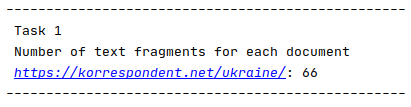

# Лабораторна робота 1. 
## Вивчення базових операцій обробки XML-документів

### Документи

[Завдання](docs/Lab1.pdf)  
[Звіт](docs/Lab1_Oleksandr_Hrytsiuk.pdf)

### 4 варіант

|№вар.| Базова сторінка (завдання 1) | Зміст завдання 2     | Адреса інтернет-магазину (завдання 3) |
|-----|------------------------------|----------------------|---------------------------------------|
| 4.  | www.korrespondent.net        | Кількість текстових фрагментів по кожному документу| www.hotline.ua |

### Скріншоти програми

  
Головне меню  
   
Завдання №1  
  
Завдання №2  
  
Таблиця  

